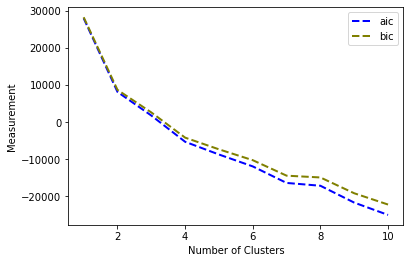

# Stayzilla Analysis

This repo contains source code for the final project for IMT 574

## Introduction

- StayZilla is an Airbnb like start up from India, it was founded in 2005 and closed in October 2017. Our original data set was part of the bigger dataset(more than 61,000 properties) that was created by extracting data from StayZilla.com.

In our original datasets there are 33 columns with 1207 rows of data. We had done a lot of data preprocessing to clean the data for future usage.

## 0. Data Preprocessing

### Cleaning Steps

- Drop trivia columns such as the scrap time, check in date, check out date, etc.
- Clean up `room_price` column to get rid of “per” string
- Split `Additional Info` column to separate response time and acceptance rate

## 1. Service Value Prediction

### Use Case

- As a member of marketing team in Stayzilla Co. I want to know whether we need to promote our service (verify their property with us) to the owner of a property based on its current data shared with us.
- As an owner of a property that has been registered in Stayzilla, I want to know whether I should verify my property by following the choice of other owners whose properties are similar to mine.
- As a customer who wants to stay in one of the property in Stayzilla, I want to know how much I can trust a non-verified property by learning the service value of similar properties.

### Solution: Use a k-nearest Neighbors

#### Rational

Based on the requirement, we want to use a binary classifier based on the numerical and boolean features. Here we use k-nearest neighbors algorithm. This strategy has several advantages on our requirement: first, it has no assumptions for inputs, which saves us lots of work since we have lots of input features; second, it can evolve constantly with new data; third, it has only one hyper parameter which is easy to implement.

#### [Implementation Details](https://github.com/uwhuan/IMT574/blob/master/knn_classify.py)

We first uses all the numeriacl and boolean features from our cleaned dataset as independent variables, and use the `service value` column as the predictive variable. Then, we build a knn model with iterative choice of $k$. For each iteration, we calculate the accuracy and f1 score of the model by 20 times and uses the average score. We tried $k$ in range from 0 to 300 and find the best $k$ neighbors.

### Results

The following is a plot of the accuracy and f1 scores. We can see that it can achieve high accuracy and f1 score in some k despite of some variation.

## 2. Clustering

### Use Case

- As a customer of Stayzilla, I want to know the similar properties based on my current choice.
- As an software engineer of Stayzilla, I want to implement a function that when the user is viewing a page of certain property, I can recommend similar properties who offer similar features (amenities, location, service, etc).
- As an owner of a property that has been registered in Stayzilla, I want to know what are the other properties that offers similar services so that I can make ajustment to my current marketing strategy.

### Solution: K-means Clustering

#### Rational

Based on the requirement, we want to use an unsupervised learning model to cluster the properties into several groups and plot the results on the map, so that the customers and the property owners can find the similar properties nearby. Here we choose K-means clustering because it scales well to large data sets, easily adapts to new data and guarantees convergence.

#### [Implementation Details](https://github.com/uwhuan/IMT574/blob/master/kmeans_cluster.py)

We first uses all the numeriacl and boolean features from our cleaned dataset as independent variables. Then we iteratively build a kmeans model using cluster amount from 4 to 15. We want to choose as small clustering as possible to give less confusion for the stakeholders, and keeps the reliability at the same time. We use the inertia value to evaluate our model since it calculates the SSE from each point to the centroid. Finally, we choose 6 as our cluster amounts and plot our results on the map.

### Results

[Cluster map](https://github.com/uwhuan/IMT574/blob/master/res/cluster.html). [Cluster and price map](https://github.com/uwhuan/IMT574/blob/master/res/cluster_clear.html)

The color indicates the different clusterings for each property. We can see that the red and orange clusters dominates most of the places. However, when we add the price feature, we can see that the green cluster has high average prices.

## 3. Expectation Maximization

### Use Case

- As a owner of the properties, I want to know whether there are any similarities regarding the prices of the properties. If so, I want to set prices for my properties according to the properties that possess similar features as my properties.

### Solution: Gaussian mixture model

#### Rational

When thinking about this question, we wonder whether the properties cluster in regards to prices and if so, how would they cluster. We first pick several variables which we believe might be the attributes of the prices; then, we explore the clustering with the Expectation Maximization (EM). It is because, in this case, to our knowledge, there is not any clear separation between the clustering. In a case like this, the reality of the situation is that there will be uncertainty about the cluster assignments, so it is ideal to use an approach that reflects that. Specifically, we are using a finite Gaussian mixture model (note that the EM algorithm is just the way you estimate the GMM, it isn't the clustering model itself) is one way to respect that fact about this particular situation.

The features we believe might determine prices of the properties are the description length, the type of the rooms (whether it is deluxe or not), number of amenities, if the properties have wifi, if the properties have an air conditioner, if the properties serve breakfast, service value, occupancy of adults and of children. We want to use these features to explore how all the properties are related to each other in regards to the prices.

#### [Implementation Details](https://github.com/uwhuan/IMT574/blob/master/em_housing.py)

Since we do not have established knowledge on what would be the optimal numbers of the clusters, I first intended to try different cluster numbers to explore how the AIC and BIC change with the cluster numbers. Also, I found that when using 90 as the max iteration number, the AIC and BIC results are relatively the smallest. Based on these thoughts and observations, I built up a model looping from 1 to 25 as clusters number, run 25 times with 90 iterations each time, and return the average AIC and BIC values for each cluster number. To further explore, I also built up two models using 1 to 15 and 1 to 10 as the cluster numbers.

### Results

Before getting further with the analysis, we would like to point out here that, we do not consider the absolute values, but rather, the values of AIC and BIC. Take AIC as an example. If we consider the calculation of AIC, it is:

AIC = 2k - 2ln(L)

With k being the numbers of parameters and ln(L) the maximized value of the likelihood function of the model. If your likelihood is a continuous probability function, it is not uncommon for the maximum value to be greater than 1. Therefore, when calculating the logarithm of the value, you get a positive number; if that value is greater than k, you get a negative AIC.

Now let us start to look at the plot of cluster number ranging from 0 to 25:

We can see from the plot that both AIC and BIC become smaller from 1 to 20, stops becoming significantly smaller at around 22, and even starts to rise when getting close to 25. When the cluster number is 25, The AIC value generated from the model is about -45229.96, and the BIC value is about -38232.77.

As was also presented in the plot, the two lines started to become flat at around 15. To further explore, I also built up two models using 1 to 15 and 1 to 10 as the cluster numbers. The plots of the results are as below:

We can take a closer look here and find that, while both the AIC and BIC are becoming smaller with the cluster number being increased, their slope does present changes. Specifically, both the slopes reduced after cluster number 2, and started to reduce significantly after around 10. As a reference, when the cluster number is 15, The AIC value generated from the model is about -35425.25, and the BIC value is about -31228.97. When the cluster number is 10, The AIC value generated from the model is about -24973.90, and the BIC value is about -22178.07.

Overall, we now know that before around 22, the more clusters we have, the smaller the AIC value and BIC value would become. The two value stops becoming much smaller at around 22. Considered our size, which, after data cleaning, is 1203 rows, 22 or 15 clusters would seem too big of a cluster number. An ideal cluster number that takes the total amount of the data into account is probably 10. This is because that the slopes of AIC and BIC values start to reduce significantly after around 10. I personally would not recommend clusters number to be smaller than 4; as we can see, the slopes before 4 are still pretty sharp.

Based on the observations above, we can further conclude that on one hand, out data do cluster; on the other hand, we can not be sure whether they cluster regarding the room prices or not, which requires further exploring on the variabels that determine the prices. Prediction of the room prices can also be conducted should the determination question is well addressed.

## 4. Room Price Prediction

### Use Case

- As a host of properties, I want to determine the optimal room price to rent out my space. The current available pricing resources online or tools from third-party are either limited or charging fees. Refering to the average price of simialr properties is not reliable in the dynamic market. So, a good machine learning model could give me a better accurate price prediction with relativelt low cost.

- As a data scientist of Stayzilla, I want to compare the performance of different models for price prediction. This will help improve the pricing guideline we procide for host customers.

### Solution: Linear Regression, Linear Regression using Gradient Descent, Random Forest Regression, Neural Network.

#### Rationale

This is a regression problem in nature. To find a better model for price prediction, we experiment with 4 regression models. We first build a linear regression as the baseline model. Then we choose gradient descent as the optimization approach because it could find the parameters (thetas) with lowest cost. For the third model, we choose random forest regression because our dataset has some invalid or blank values and random forest is good at handling missing data. Lastly, we also build a four-layer neural network, as our variables are not very straightforward in terms of their relationships with the room price. A neural network is a great choice to capture the hidden patterns in data if any. Also, we want to see if there is any difference between the traditional machine learning algorithms and deep learning in this use case.

#### [Data Preparation](https://github.com/uwhuan/IMT574/blob/master/PricePrediction_DataCleaning.ipynb)

_Feature Engineering:_  
The original dataset has 33 variables, 1207 observations. For most variables, the last 68 observations are missing, which will be excluded here. There is only 1 variable (image_cout) is numeric in default. The rest of variables are categorical and some of them are text data. We transform some categorical variables into numeric meaning, for example, turning the amenities description to the number of amenities mentioned in the description. Also, we extract some important amennies into boolean values (eg. wifi, ac). Details of feature engineering are provided in the codes with comments. Additionally, for categorical variable with more classes (eg. property type), we encode them to a matrix. For longitude and latitude columns,we group them using K-means clustering and take the output label as the feature in regression models. The target variable is ‘room_price’. The final features (22 features, the last 8 are property types) sare shown in the table.  

`'image_count', 'adult_occupancy', 'child_occupancy', 'num_amenities', 'zones', 'descr_len', 'deluxe', 'num_simhotel', 'wifi', 'ac', 'breakfast', 'service_value', 'acceptance_rate', 'response_label', 'Apartment', 'Homestay', 'Hotel', 'House', 'Lodge', 'Resort', 'Spa', 'Villa'`  

_Additional data cleaning:_  
After determining the features, we further clean the data to impute the missing values with 0 for some variables. We also remove the outliers of room_price. Lastly, we check the correlation between features for any potential multicollinearity.

#### [Implementation Details](https://github.com/uwhuan/IMT574/blob/master/PricePrediction-Models.ipynb)

We scale them before fitting a model. The metrics used to evaluate a model are test MSE and adjusted r square. For gradient descent, we set the epsilon is 10\*-10, and adjust the alpha to decrease the cost. The alpha is set as 0.0001. There are 393 iterations until convergence. For random Forest, the number of estimators is 100. For neural network, the input layer has 22 nodes and the output layer has 1 node. For hidden layers, considering we are dealing with a relatively small data, we only tried one layer and two layers, and the performance of two layers is better. The final neural network has four-layers with the linear activation for the output layer and relu activation functions for all other layers. The hidden layers have 200, 10 nodes and the number of epochs is 20.  

### Results

The plot and the table show the results of four models. As we can see, random forest overfits the model. The baseline model is actually doing a better job than other models in test MSE. It is surprising the neural network has low test MSE. This may be because the data size is small and the features all together do not contribute much to the explanation of the target variable. This can also be seen as the adjusted r square. The highest adjusted r square (from linear regression model) is only 0.21, which means the features can explain around 21% of the variance in room price.  

The poor performances of four models indicate that the features, when feeding together, do not substantially affect the price very much. Additionally, the room price in the homestay industry can change quickly due to market dynamics, our data does not capture such patterns because all the data is on the same check-in and check-out date. In the future, we may want to explore more features such as the house star rate and the landmarks to improve prediction outcome.

## 5. Classification

### Use Case

- As an owner of a property, I want to estimate the expected user feedback. If so, I can refine the description content and improve the provided services to get a higher user rating and increase traffic and order number.
- As an operational/product analyst of Stayzilla, I want to have predicted feedback toward a newly-registered property so that I can better arrangement of the search result to avoid new property receiving a low exposure rate.

### Solution: Use support vector machine

#### Rational

- Feature selection:
  The response variable is user rating on a scale of 0 to 4. The relevant predictor variables are the descrition of the hightlight value of the property, the distance to landmark, the services & amenities provides by the property, and the number of room types it provides. From the practical life experiences and business logic, all these predictor variables convey information about the service quality.

- Method selection:
  The user rating (response variables) is a categorical value, we want to construct a classification model to make the prediction. Because among the predictor variables, we have a mixed type features space with both categorical and continuous numerical value, kernel-based models are optimal for prediction. And because the dataset has an extraordinary high dimension, SVM/NN would generally have a better performance under high dimension data. For this situation, both methods were applied and open for comparing results. But because Neural networks require more hyperparameter to tune and generally consume a longer training time, the selection will favor the result of SVM under the non-linear kernel method instead of neural networks with different network structures.

#### [Implementation Details](https://github.com/uwhuan/IMT574/blob/master/stars_rate_classifer.py)

Because some of the features are text-based, the major job in the data cleaning phase is to extract numerical and categorical data from text. For example, CountVectorizer was used to apply the bag of words model to vectorize the feature of `highlight_value`. And we also use regex based method to substitute and transform the features such as `landmark`, `service_value`, and `amenities`. The final dimension of training data contains 1109 features, where 20 of them are categorical predictor variables and the rest of them are word vectors.

We train the data with the KVM method by applying kernel functions of linear, polynomial, sigmoid, with a randomized split training & testing dataset, and iterate 50 times to get an average metric result. Then experiment with a naive network structure of 4 layers neural network with RELU activation function on all layers and get a result in 100 epochs.

### Results

The following table shows the result of the accuracy and f1 scores:

| method | kernal method | average accuracy | f1 score |
| ------ | ------------- | ---------------- | -------- |
| svm    | linear        | 63.5%            | 0.305    |
| svm    | polynomial    | 68.5%            | 0.260    |
| svm    | sigmoid       | 69.4%            | 0.251    |
| nn     | -             | 71.0%            | 0.710    |
